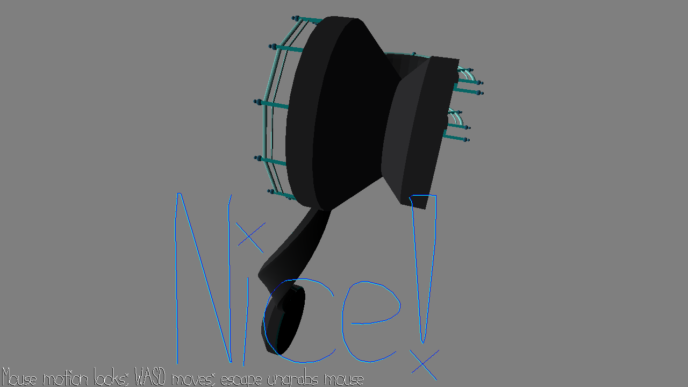
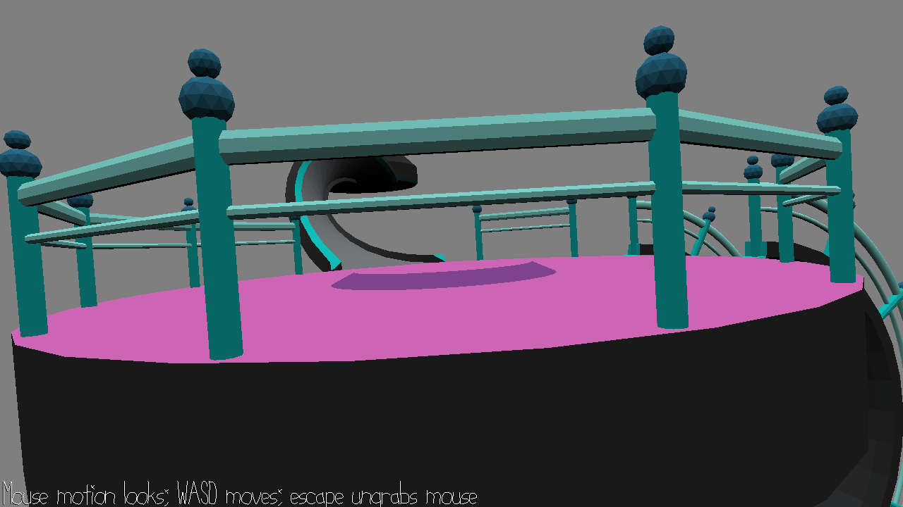

# Breaking the game simulator

Author: Pablo Wilson

Design: Have you ever thought you just had too much enjoyment in your life? Tired of playing game for fun? Well look no further than this "game"! It's like your typical walking simulator, except the creator still has zero clue on how to make good looking walkmeshes or how to avoid d being greater than .9! The objective is simple, try to break away from the map as far as you can on the hidden invisible walkway. Think of it as a <s>bug</s> puzzle hunt:)

Screen Shot:

How To Play:

WASD to move, mouse to look. While there are multiple broken paths, there is only one correct one, and it takes a bit of wiggling. Look at the screenshot for a hint on the entrance

Sources: Original map and walkmesh by Jim McCann that I mangled with my <s>lack of</s> blender skillz

This game was built with [NEST](NEST.md).

